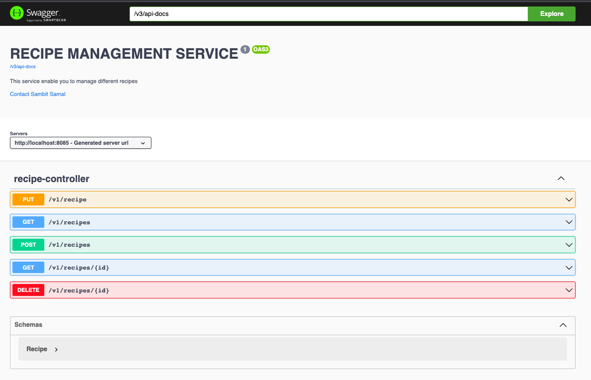

# Recipe Management Service

## Description:

This service will allow you to manage different recipes.

## Functionalities

- User can add, update, delete and fetch recipes
- User can filter available recipes based on different criteria. Examples:
    1. Whether or not the dish is vegetarian
    2. The number of servings
    3. Specific ingredients (either include or exclude)
    4. Text search within the instructions.

## Tech Stack

- Java 11
- SpringBoot
- Embedded MongoDB
- Spring AOP
- JUnit 5

## Pre-requisite

- Java 11
- Maven
- Git bash (Or any IDE from where you can connect to git)

## Steps to run the application

- Checkout the code / Download from git repo(https://github.com/sambit1007599/recipe-management-service.git)
- checkout : open git bash and run command `git clone https://github.com/sambit1007599/recipe-management-service.git`
- open command prompt(cmd)
- go inside the project folder
- run command `mvn clean install`
- once its successfully build run command `mvn spring-boot: run`

Now application is up and running (http://localhost:8085/swagger-ui/index.html)
